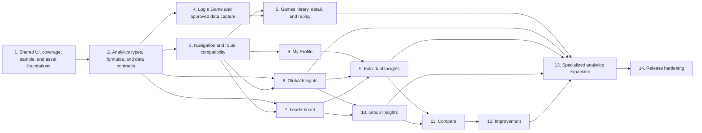

# TM Stats Final Migration Matrix

- Phase: Phase 0, Step 0.6
- Completed: 2026-07-17
- Branch baseline: `redesign/tm-stats-dashboard-rebuild` at `90d67b546`
- Scope: documentation-only consolidation of the Phase 0 route, component,
  analytics, data, asset, and validation audits

This matrix is the actionable current-to-target plan. It does not authorize a
route move, component redesign, migration, Supabase change, formula change, or
Phase 1 implementation. "Alias" below means a compatibility redirect or wrapper
that preserves authentication, group context, URL state, and deep links until
the stated retirement condition is proven.

## 1. Executive summary

Phase 0 found a healthy application baseline and a workable finalized-game core,
but the current information architecture concentrates too much responsibility in
`/insights`, `/group`, `InsightsDashboard`, `GroupDashboard`, and
`analytics-repo.ts`. The redesign should proceed by creating shared UI, coverage,
asset, and analytics contracts first; establishing target route ownership without
breaking legacy links; then replacing one current responsibility at a time.

The migration inventory contains:

- 19 route records: 14 pages, four route handlers, and the favicon metadata route;
- 59 meaningful React components;
- current global, player, group, comparison, game, leaderboard, and improvement
  analytics capabilities;
- a dedicated card-acquisition plan for Cards Purchased, Cards Seen, Purchase
  Conversion, Purchased Hand Share, Hand Utilization, End-Hand Carryover,
  Purchase Pace, and Seen Pace;
- 16 asset families, including public, private, tracked, live-only, incomplete,
  duplicated, and unavailable sources.

Current final scores, placement, winners, maps, configurations, corporations,
Preludes, styles, key-card selections, objectives, head-to-head results, and many
aggregate summaries can be reused. Card acquisition, per-generation/final TR,
duration, production/engine state, canonical board coordinates, and durable
recommendation/goal state require new persisted facts. Missing historical facts
must remain unavailable; they cannot be reconstructed from final totals.

The audited implementation order is retained at the top level because its
dependencies are supported by the evidence. Two gates are made explicit: Phase 1
must include shared asset and unavailable/coverage primitives, and Phase 2 must
approve data contracts and canonical formulas before Phase 4 adds capture. No
later analytics page may outrun its data-coverage gate.

## 2. Phase 0 exit assessment

| Exit criterion | Status | Evidence / completion rule |
| --- | --- | --- |
| Route inventory complete | Pass | `CURRENT-ROUTE-MAP.md` records all 14 pages, four handlers, favicon, layouts, middleware, guards, queries, and target ownership. |
| Component inventory complete | Pass | `COMPONENT-MIGRATION-MATRIX.md` records 59 meaningful components; two tiny wizard helpers are explicitly excluded. |
| Data capability audit complete | Pass | `DATA-CAPABILITIES.md` classifies the finalized-game core, derived analytics, unsupported facts, and all 20 requested card-acquisition capabilities. |
| Asset inventory complete | Pass | `ASSET-INVENTORY.md` records seven live buckets, tracked/local sources, database references, coverage, access, resolvers, fallbacks, and drift. |
| Baseline validation complete | Pass | 55 test files / 137 tests passed; typecheck passed; lint and build passed with only the four documented baseline warnings. |
| Migration matrix complete | Pass | This document consolidates routes, components, analytics, data, assets, dependencies, risks, compatibility, validation, and entry criteria. |
| No undocumented blockers | Pass | All known blocking decisions and unresolved questions are recorded in Section 15 and assigned to the phase they gate. None blocks Phase 1, Step 1.1. |
| Working tree clean | Pass at completion | The dedicated redesign worktree was clean before Step 0.6; only the three Step 0.6 documentation files are committed; post-commit status must be empty. |
| All Phase 0 work committed | Pass at completion | Steps 0.1-0.5 are committed; the Step 0.6 documentation-only completion commit closes Phase 0. |
| No production behavior changed | Pass | Phase 0 changes are documentation-only; no application code, query, schema, migration, Supabase data, Storage object, or route behavior changed. |

**Phase 0 exit decision:** ready to enter **Phase 1, Step 1.1 — Shared
Design Foundations** after the Step 0.6 commit is present and the redesign
worktree is clean.

## 3. Current routes to target routes

| Current route | Current source file | Current responsibility | Target route | Compatibility alias required | Authentication and group requirements | Components affected | Data dependencies | Target implementation phase | Retirement condition | Risk |
| --- | --- | --- | --- | --- | --- | --- | --- | --- | --- | --- |
| `/` | `src/app/page.tsx` | Public landing and sign-in entry | `/` | No | Public; no group | `HomePage`, `RootLayout` | None | Phase 1 shell; later hardening | Never retire; only refactor after landing tests | Low |
| `/login` | `src/app/(auth)/login/page.tsx` | Sign-in and account creation shell | `/login` | No | Public; no group | `LoginPage`, `LoginForm` | Auth endpoints, username availability RPC | Phase 3/20 | Retain; auth consolidation requires E2E parity | Low |
| `/forgot-pin` | `src/app/(auth)/forgot-pin/page.tsx` | PIN-reset request entry | `/forgot-pin` or shared login recovery entry | No while route remains | Public; no group | `ForgotPinPage`, `ForgotPinForm` | `POST /auth/request-pin-reset` | Phase 20 | Retire only if the shared recovery entry preserves destination and E2E behavior | Low |
| `/reset-pin` | `src/app/(auth)/reset-pin/page.tsx` | Duplicate reset wrapper | `/auth/reset-pin` | Yes | Public recovery session/tokens; no group | Legacy reset page, `ResetPinForm` | Supabase Auth recovery session | Phase 3/20 | All recovery link formats and destinations pass E2E tests through `/auth/reset-pin` | Medium |
| `/auth/reset-pin` | `src/app/auth/reset-pin/page.tsx` | Canonical PIN reset | `/auth/reset-pin` | No | Public recovery session/tokens; no group | Canonical reset page, `ResetPinForm`, recovery bridge | Supabase Auth recovery session | Phase 3/20 | Retain | Low |
| `/cards` | `src/app/(app)/cards/page.tsx` | Promo-set catalog browser | `/cards` | No | Auth + active group; middleware coverage must be aligned | `CardsPage`, `PromoSetBrowser`, shell/switcher | group context, `promo_sets`, `cards`, asset metadata | Phase 3 route guard; Phase 13 domain work | Retain; clarify promo-only versus full catalog before expansion | Medium |
| `/group` | `src/app/(app)/group/page.tsx` | Group dashboard, leaderboard, global context, final-action stats | `/insights/group`, `/leaderboard`, plus undecided supporting group destination | Yes, because ownership splits | Auth + active group | `GroupPage`, `GroupDashboard`, global boards, final-action table, shell nav | full group analytics bundle; remote-only final-action RPC | Phase 3 alias; Phases 7/10/18 replacements | Group analytics and leaderboard replacements have parity, permissions, empty/error states, and legacy links redirect safely | High |
| `/group/players` | `src/app/(app)/group/players/page.tsx` | Active-group roster list/add | Supporting Players or Group Members route, URL undecided | Yes if moved | Auth + active group; write action rechecks group | `PlayersPage`, `PlayerList`, shell/switcher | players, group context, player creation | Phase 3 decision; Phase 10 implementation | Approved URL and Players-vs-Members ownership; links/actions/permissions tested | Medium |
| `/group/settings` | `src/app/(app)/group/settings/page.tsx` | Group name, analytics opt-in, defaults | Supporting Group Settings route, URL undecided | Yes if moved | Auth + active group; role semantics currently equal-member write | `GroupSettingsPage`, `GroupSettingsForm`, shell/switcher | group settings, expansions, promo sets, RLS | Phase 3 decision; Phase 10/20 implementation | Approved URL and actual owner/editor/viewer policy are tested | Medium |
| `/insights` | `src/app/(app)/insights/page.tsx` | Global, individual, compare, pairings, replay, scoring DNA | `/insights/global`, `/insights/individual`, `/compare`; replay to `/games/[gameId]/replay` | Yes | Auth + active group | `InsightsPage`, `InsightsDashboard`, pairings, replay, score profile, global boards | broad group analytics, players, replay events, reference assets | Phase 3 alias; Phases 5/8/9/11 | Every owned section has a tested target; `scope`/anchor and deep links map intentionally; legacy page has no unique content | High |
| `/log-game` | `src/app/(app)/log-game/page.tsx` | Create/reopen draft, save, finalize | `/log-game` | No | Auth + active group; actions reauthorize | page, wizard, six steps, evidence summary | group/reference catalogs, drafts/imports, finalization, refresh | Phase 4 | Retain; internal refactor only after save/reopen/finalize parity | High |
| `/log-game/import` | `src/app/(app)/log-game/import/page.tsx` | Reviewable log/screenshot import into draft | `/log-game/import` | No | Auth + active group; no-group behavior unresolved | import page/shell/form/review/evidence | groups, maps, players, drafts, private evidence, OCR | Phase 4 | Retain; no retirement planned | High |
| `/profile` | `src/app/(app)/profile/page.tsx` | Identity plus deep personal analytics | `/profile`; deep analytics to `/insights/individual`; guidance to `/improvement` | No for `/profile`; preserve links during split | Auth + active group | `ProfilePage`, `ProfileDashboard`, style/efficiency/map/score components | profile analytics and broad group bundle | Phase 6; Phases 9/12 | Profile has identity/activity/groups/status/shortcuts and every removed analytic has a tested destination | High |
| `/saved-games` | `src/app/(app)/saved-games/page.tsx` | Draft/finalized game library | `/games` | Yes | Auth + active group; middleware protection must preserve destination | `SavedGamesPage`, shell/switcher; future detail/replay | direct `games` query, group context | Phase 5 | `/games`, detail and replay permissions/links pass; drafts reopen; legacy links redirect | High |
| `GET /auth/callback` | `src/app/auth/callback/route.ts` | PKCE exchange and recovery-hash bridge | Same | No | Public; no group | Recovery bridge/form indirectly | Supabase Auth | Phase 20 | Retain unless auth-specific redesign proves a simpler path | Medium |
| `GET /auth/complete` | `src/app/auth/complete/route.ts` | Post-auth destination normalization | Same | No | Public; no group | Login flow indirectly | None | Phase 20 | Retain unless all callers and safe-next tests are replaced | Low |
| `POST /auth/request-pin-reset` | `src/app/auth/request-pin-reset/route.ts` | Enumeration-safe branded recovery request | Same | No | Public; no group | `LoginForm`, `ForgotPinForm` | admin profile lookup, Auth link generation, email provider | Phase 20 | Retain as canonical endpoint | Medium |
| `POST /auth/username-login` | `src/app/auth/username-login/route.ts` | Username/email + PIN sign-in | Same | No | Public; no group | `LoginForm` | admin profile lookup, Supabase Auth | Phase 20 | Retain unless auth consolidation has full parity | Medium |
| `/favicon.ico` | `src/app/favicon.ico` | Static metadata icon | Same | No | Public | `RootLayout` metadata | Tracked file | Phase 1/20 | Retain | Low |

New target routes with no current source are `/games/[gameId]`,
`/games/[gameId]/replay`, `/insights/global`, `/insights/individual`,
`/insights/group`, `/compare`, `/improvement`, and `/leaderboard`. They must be
introduced behind explicit auth/group guards before any legacy owner retires.

## 4. Current components to target destinations

Every meaningful component from the Phase 0 inventory appears below. Existing
tests list direct tests first; "parent" means the current parent test renders the
component. Required tests are migration gates, not work authorized by Step 0.6.

| Component name | Source file | Current route or parent | Current responsibility | Recommended action | Target destination | Dependencies | Existing tests | Required new tests | Migration phase | Retirement condition | Risk |
| --- | --- | --- | --- | --- | --- | --- | --- | --- | --- | --- | --- | --- |
| RootLayout | `src/app/layout.tsx` | All routes | Document, metadata, global recovery bridge | retain | Root layout | global CSS, `RecoveryHashRedirect` | recovery child test | layout metadata and recovery integration | 1/20 | Never; only simplify after recovery parity | Low |
| HomePage | `src/app/page.tsx` | `/` | Public landing | retain | `/` | banner, global styles | `src/app/page.test.tsx` | responsive/accessible navigation | 1/3 | Retain | Low |
| ProtectedLayout | `src/app/(app)/layout.tsx` | All `(app)` routes | Cookie-presence guard | refactor | Authenticated route layout | cookies, middleware, route guards | route-guard and E2E coverage | full protected-route/next matrix | 3 | Replacement verifies server auth and destination preservation | Medium |
| AppShell | `src/components/layout/app-shell.tsx` | All protected pages | Banner, desktop/mobile nav, page header, account controls | split | Shared authenticated shell + navigation primitives | banner, `BottomNav`, `LogoutButton` | `app-shell.test.tsx` | target nav, active state, mobile/desktop, all route links | 1/3 | New shell renders all protected routes with parity | High |
| BottomNav | `src/components/navigation/bottom-nav.tsx` | `AppShell` | Five-item mobile nav | replace | Responsive primary navigation | target route registry | parent shell test | eight-page target nav and active route | 3 | New responsive nav is deployed and tested | Medium |
| LogoutButton | `src/components/navigation/logout-button.tsx` | `AppShell` | Sign out and redirect | retain | Shared account control | browser Supabase Auth | parent shell test | success, error, pending behavior | 1/3 | Retain | Low |
| GroupSwitcher | `src/features/groups/group-switcher.tsx` | Eight protected pages | Select/persist active group | refactor | Shared authenticated header/context | group context repo, server action | group-context repo/guard tests | direct switching, return path, one/many groups, failure | 1/3 | New query ownership preserves behavior | Medium |
| ChartFrame | `src/components/charts/chart-frame.tsx` | Analytics pages | Panel chrome plus title-triggered behavior | replace | Typed analytics section/card primitives | CSS module, `HeadToHeadLensFrame` | `chart-frame.test.tsx` | explicit variants; no title-string behavior | 1 | All consumers use typed variants with visual/accessibility parity | High |
| HeadToHeadLensFrame | `src/components/charts/head-to-head-lens-frame.tsx` | `ChartFrame` special case | Parse children/text into matchup view | replace | Typed head-to-head view | rendered child structure | indirect frame test | typed rows, ties, missing margin, accessibility | 1/2/11 | No consumer parses React children/text | High |
| CoverageBadge | `src/components/charts/coverage-badge.tsx` | Group/profile/insights dashboards | Render numeric coverage percentage | retain | Shared coverage primitive | parent numeric fraction | `coverage-badge.test.tsx` | unavailable/partial behavior at wrapper level | 1 | Retain for valid observed fractions | Low |
| LoginPage | `src/app/(auth)/login/page.tsx` | `/login` | Auth shell and safe next path | retain | `/login` | `LoginForm`, URL helper | page test | recovery error and destination cases | 3/20 | Retain | Low |
| ForgotPinPage | `src/app/(auth)/forgot-pin/page.tsx` | `/forgot-pin` | Reset-request shell | merge | Shared recovery entry or retained route | `ForgotPinForm` | form test | caller destination/E2E | 20 | Shared entry proves parity | Low |
| Legacy ResetPinPage | `src/app/(auth)/reset-pin/page.tsx` | `/reset-pin` | Duplicate reset wrapper | retire | Alias to `/auth/reset-pin` | `ResetPinForm` | form test | legacy-link redirect and both token formats | 3/20 | Canonical recovery E2E passes | Medium |
| Canonical ResetPinPage | `src/app/auth/reset-pin/page.tsx` | `/auth/reset-pin` | Canonical recovery shell | retain | `/auth/reset-pin` | next-path helper, `ResetPinForm` | form/callback tests | page destination integration | 3/20 | Retain | Low |
| LoginForm | `src/features/auth/login-form.tsx` | `/login` | Sign-in, sign-up, confirmation, reset request | refactor | Canonical auth form | auth handlers, browser Supabase | `login-form.test.tsx` | nonexistent default-path regression; error states | 20 | Retain until narrower flows pass | Medium |
| ForgotPinForm | `src/features/auth/forgot-pin-form.tsx` | `/forgot-pin` | Submit recovery request | merge | Shared recovery request interaction | reset endpoint | `forgot-pin-form.test.tsx` | destination preservation and network errors | 20 | Shared interaction has parity | Low |
| ResetPinForm | `src/features/auth/reset-pin-form.tsx` | Both reset routes | Establish recovery session and update PIN | retain | Canonical reset route | Supabase Auth, URL hash/history | `reset-pin-form.test.tsx` | E2E implicit-hash and existing-session modes | 20 | Retain | Medium |
| RecoveryHashRedirect | `src/features/auth/recovery-hash-redirect.tsx` | `RootLayout` | Rescue recovery tokens on any route | retain | Global auth infrastructure | URL hash, Supabase Auth | direct test | full callback/route integration | 20 | Only retire after all recovery transports are proven unnecessary | Medium |
| ProfilePage | `src/app/(app)/profile/page.tsx` | `/profile` | Load identity plus personal/group analytics | split | `/profile`, `/insights/individual`, `/improvement` | profile and broad group repositories | child/repo tests | page contract, scoped-query, no-group state | 6/9/12 | Compact profile and target analytics have parity | High |
| ProfileDashboard | `src/features/analytics/profile-dashboard.tsx` | `ProfilePage` | Seven-section personal analytics composite | split | Profile summary + Individual Insights sections | efficiency, maps, score, objectives, coverage | `profile-dashboard.test.tsx` | section-level missing/zero, focused identity | 6/9 | Every deep section has target owner | High |
| LogGamePage | `src/app/(app)/log-game/page.tsx` | `/log-game` | Load draft/reference data and host save/finalize actions | split | `/log-game` orchestration/services | group, catalogs, drafts, imports, finalization, refresh | wizard/draft/finalize/repo/E2E tests | page load, auth, transaction/revalidation parity | 4 | Retain route; retire inline orchestration after parity | High |
| LogGameImportPage | `src/app/(app)/log-game/import/page.tsx` | `/log-game/import` | Persist setup draft, evidence, OCR correction | split | Import workflow action service | group/settings/maps/players, Storage, OCR | shell/page/repo/helper tests | no-group, authorization, partial-failure, provenance | 4 | Inline action replaced with tested service | High |
| LogGameWizard | `src/features/games/log-game/log-game-wizard.tsx` | `LogGamePage` | Whole draft form and six-step wiring | split | Log a Game workflow shell | RHF, Zod, review builder, server actions | `log-game-wizard.test.tsx` | step transitions, save/finalize intent, missing vs zero | 4 | New shell preserves all draft/finalize behavior | High |
| SetupStep | `src/features/games/log-game/setup-step.tsx` | `LogGameWizard` | Date, map, counts, expansions/promos, import link | retain | Log a Game setup | reference rows, RHF | parent wizard test | field validation/config coverage | 4 | Retain until redesigned equivalent passes | Low |
| PlayersStep | `src/features/games/log-game/players-step.tsx` | `LogGameWizard` | Seats, roster resolution, corp/Prelude choices | refactor | Log a Game players/setup | player identity, corp/Prelude options, RHF | parent + resolution tests | provisional identity, multi-Prelude, missing reference | 4 | Replacement preserves identity resolution | Medium |
| MilestonesStep | `src/features/games/log-game/milestones-step.tsx` | `LogGameWizard` | Milestone and award entry | split | Log a Game objectives stage | map objectives, players, RHF | parent/finalize tests | objective-specific validation and unavailable timing | 4/18 | New subforms preserve payload semantics | Medium |
| ScoresStep | `src/features/games/log-game/scores-step.tsx` | `LogGameWizard` | Final totals and score sources | refactor | Log a Game scoring | score schema, RHF | parent/finalize tests | nullable optional sources, reconciliation, explicit zero | 4/15 | Canonical field model passes parity | Medium |
| StyleStep | `src/features/games/log-game/style-step.tsx` | `LogGameWizard` | Declared styles and key cards | split | Log a Game style + card evidence stages | styles/cards, RHF | parent/finalize tests | none-vs-unrecorded, duplicate key cards | 4/13/15 | Separate inputs preserve stored semantics | Medium |
| ReviewStep | `src/features/games/log-game/review-step.tsx` | `LogGameWizard` | Notes, shallow summary, validation/warnings | refactor | Finalization review and game detail summary | `GameReview`, RHF | parent/finalize tests | accessible errors, partial data, final detail handoff | 4/5 | Replacement review has parity | Medium |
| LogGameImportShell | `src/features/imports/log-game-import-shell.tsx` | `/log-game/import` | Adapt import result to draft action/navigation | retain | Import workflow boundary | router, parent action | direct test | error normalization and destination | 4 | Merge only if boundary is genuinely redundant | Low |
| WebImportPage | `src/features/imports/web-import-page.tsx` | `LogGameImportShell` | Manual setup, raw log, screenshot OCR and submission | split | Import input/OCR/review components | browser OCR, file state, action | direct test | progress, cancel/retry, editable OCR, partial save | 4 | New subcomponents preserve reviewable evidence | High |
| ImportReviewPanel | `src/features/imports/import-review-panel.tsx` | `WebImportPage` | Static pipeline explanation | replace | Real import review/status | None | parent test | status/coverage/error states | 4 | Real state replaces explanatory placeholder | Low |
| ImportEvidenceSummary | `src/features/imports/import-evidence-summary.tsx` | Reopened imported draft | Textual saved evidence summary | move | Import review and `/games/[gameId]` | import summary; future signed asset resolver | direct test | private URL expiry/unavailable and permissions | 4/5 | Replacement detail retains evidence visibility | Low |
| SavedGamesPage | `src/app/(app)/saved-games/page.tsx` | `/saved-games` | List drafts/finalized games | replace | `/games` | direct games query, group context | None direct | repository, permissions, draft/final links, empty/error | 5 | `/games` parity and legacy alias verified | High |
| GamePaceReplay | `src/features/insights/game-pace-replay.tsx` | `/insights` | Select game and plot cumulative played-card pace | move | `/games/[gameId]/replay` | replay repo, events, Recharts | None direct | single-game input, missing generation, actor/dedupe/coverage | 5/16 | Detail/replay route passes semantics and permissions | High |
| InsightsPage | `src/app/(app)/insights/page.tsx` | `/insights` | Load and derive multi-scope analytics | split | Global/Individual/Compare + game replay | broad group bundle, players, replay | child/repo tests | route ownership, query scope, compatibility alias | 3/5/8/9/11 | No unique content remains | High |
| InsightsDashboard | `src/features/insights/insights-dashboard.tsx` | `InsightsPage` | Mega-dashboard across most analytics domains | split | Phases 7-19 target pages | full `GroupAnalytics`, Recharts, insight builder | dashboard + insight-builder tests | section parity, formulas, missing data, focus identity | 7-19 | Every section has a tested owner and legacy dashboard is unreferenced | High |
| GlobalMetricBoard | `src/features/analytics/global-metric-board.tsx` | Group + insights dashboards | Global map baseline cards | move | `/insights/global` map section | global map summaries, reference identity/assets | parent tests | empty/partial data, typed map labels/assets | 8/17 | Global route replacement has parity | Medium |
| GlobalSummaryBoard | `src/features/analytics/global-summary-board.tsx` | Group + insights dashboards | Catch-all seven-domain global summary | split | `/insights/global` and domain analytics | seven global arrays, child panels | parent/corp tests | per-domain empty/error/sample states | 8/13-18 | All domains have explicit owners | High |
| AwardMapSummary | `src/features/analytics/award-map-summary.tsx` | `GlobalSummaryBoard` | Award outcomes plus invented map preview | split | Global objectives; verified map context | award summaries, inline SVG | None direct | typed maps, verified assets, missing art, outcome math | 8/17/18 | Invented preview removed after verified asset path exists | High |
| ScoreProfilePanel | `src/features/insights/score-profile-panel.tsx` | `/insights` | Scoring DNA and hardcoded score icons | refactor | Individual Insights scoring | score entries, client formulas, hardcoded asset map | None direct | missing vs zero, canonical source set, resolver fallbacks | 2/9/15 | Typed model/resolver view has parity | High |
| ScoreSourceRadar | `src/features/analytics/score-source-radar.tsx` | `ProfileDashboard` | Player-vs-group nine-source radar | merge | Individual/Compare scoring views | score averages, SVG | parent profile test | canonical ten-source policy, missing values, accessibility | 9/11/15 | Shared model supports deliberate radar variant | Medium |
| ScoreSourceList | `src/features/analytics/score-source-list.tsx` | `GroupDashboard` | Ranked ten-source average/share list | merge | Group/Individual scoring views | score averages, local builder | leaderboard helper + parent test | shared formula parity and nullable sources | 2/15 | Shared model/list replacement passes | Medium |
| StyleEffectivenessPanel | `src/features/analytics/style-effectiveness-panel.tsx` | `/profile` | Style scope switch, benchmarks, narrative | split | Individual, Global, Improvement | style rows, score averages, client calculations | direct test | centralized benchmark/narrative/sample/coverage | 2/9/12/15 | Target views consume tested model | High |
| EfficiencySummary | `src/features/analytics/efficiency-summary.tsx` | `ProfileDashboard` | Personal efficiency summary | move | Individual Insights/Improvement | player metric summary | parent profile test | null expected score, samples, context labels | 9/12/16 | Retain as shared variant if contract remains valid | Low |
| AwardMilestoneSummary | `src/features/analytics/award-milestone-summary.tsx` | `ProfileDashboard` | Mixed objective/coverage cards | split | Individual objectives/competition | player metric summary | parent profile test | unavailable timing, coverage, separate domains | 9/18 | Focused replacements exist | Medium |
| MapPerformanceList | `src/features/analytics/map-performance-list.tsx` | Profile + group dashboards | Top map performance cards | refactor | Individual/Group Insights | player-map summaries | parent profile/group tests | focused-player identity, reference mapping, samples | 9/10/17 | Shared typed version has explicit subject | Medium |
| GroupPage | `src/app/(app)/group/page.tsx` | `/group` | Group/global/leaderboard/final-action orchestration | split | `/insights/group`, `/leaderboard`, support routes | broad analytics + final-action RPC | child/repo tests | route query ownership, RPC error vs empty | 7/10/18 | Split targets and alias pass | High |
| GroupDashboard | `src/features/analytics/group-dashboard.tsx` | `GroupPage` | Eleven-section group/global composite | split | Group Insights, Leaderboard, Global, Compare | 15 props, child analytics, laurels | direct + leaderboard helper tests | section parity, identity, coverage, samples | 7/8/10/11/18 | All responsibilities have target owners | High |
| FinalTerraformingActionTable | `src/features/insights/final-terraforming-action-table.tsx` | `/group` | Client consolidation and final-action comparisons | refactor | Group/objectives; later Individual/Compare | remote-only RPC, client formulas | None direct | RPC contract/security, identities, error/empty, formulas | 2/18 | Verified typed read model replaces client grouping | High |
| LineupEffectsPanel | `src/features/insights/lineup-effects-panel.tsx` | Unused | Rich lineup explorer | refactor | Group Insights/Compare | lineup rows, label parsing | direct test | typed membership, table size, samples, missing | 10/11/18 | Adopted as canonical or explicitly retired after replacement | Medium |
| PlayersPage | `src/app/(app)/group/players/page.tsx` | `/group/players` | Roster page/action | move | Players or Group Members support route | group context, player repo | child/repo tests | route permissions and ownership boundary | 3/10 | Approved target route passes | Medium |
| GroupSettingsPage | `src/app/(app)/group/settings/page.tsx` | `/group/settings` | Group settings loader/action | move | Group Settings support route | settings/reference repos, RLS | child/schema tests | role enforcement, action errors, route permissions | 3/10/20 | Approved route and RLS semantics pass | Medium |
| PlayerList | `src/features/groups/player-list.tsx` | `PlayersPage` | Add/list saved players | refactor | Players/Group Members | player schema/action | direct test | linked status, duplicate/error, permissions | 10 | Target component matches promised behavior | Low |
| GroupSettingsForm | `src/features/groups/group-settings-form.tsx` | `GroupSettingsPage` | Edit name, analytics opt-in, defaults | move | Group Settings | RHF/Zod, action | direct test | dirty state, role display, failure/retry | 10/20 | Retain if contract remains valid | Low |
| CardsPage | `src/app/(app)/cards/page.tsx` | `/cards` | Promo catalog host | refactor | `/cards` | group context, promo/card repository | child test | route permissions, all-vs-promo ownership, error state | 3/13 | Retain | Medium |
| PromoSetBrowser | `src/features/catalog/promo-set-browser.tsx` | `/cards`; empty copy in insights | Filter promo cards and open art | move | `/cards` only | promo/card rows, remote images | direct test | resolver error/loading/responsive/accessibility | 13 | Insights copy removed after Global replacement | Low |
| CorporationMetaPanel | `src/features/analytics/corporation-meta-panel.tsx` | Global summary | Corporation ranking and client weighting | refactor | Global corporation analytics | global corp summaries, local formula, future logos | direct test | centralized weighting, sample/coverage, logo fallback | 2/14 | Typed calculation/asset model passes | High |
| CorporationPreludePairingsPanel | `src/features/analytics/corporation-prelude-pairings-panel.tsx` | `/insights` | Parse labels, aggregate pairings, show context | refactor | Global/Group/Compare corporation-Prelude views | interaction rows, score averages | direct test | typed IDs, multi-Prelude, scope-correct score context | 2/11/14 | Typed repository output eliminates label parsing | High |

## 5. Analytics migration matrix

Availability labels are intentionally strict:

- **CURRENT** — supported by current persisted facts for the stated scope;
- **DERIVABLE** — exact current facts exist, but one canonical tested formula is
  still required;
- **QUERY** — current shapes exist, but repository/view/writer/coverage work is
  required before the result is trustworthy;
- **NEW** — new persisted fields, events, or tables are required;
- **NO BACKFILL** — missing historical values cannot be reconstructed honestly.

### 5.1 Existing analytics capabilities and dashboards

| Metric or dashboard | Current availability | Source data | Current calculation or repository | Target dashboard | Required query work | Required schema work | Coverage limitations | Sample-size requirements | Target phase | Blocking dependencies |
| --- | --- | --- | --- | --- | --- | --- | --- | --- | --- | --- |
| Formal leaderboard | CURRENT, methodology pending | finalized games/results | `analytics.group_leaderboard`, `getGroupAnalytics`, current weighted score | Leaderboard | narrow ranking read model; tie-aware margin; eligibility | None for current group ranking; opponent model needs view/RPC | finalized group games only; optional metrics vary | Show eligible games/player; methodology and minimum N must be approved | 2/7 | ranking/eligibility decision; canonical differential |
| Placement and winner analysis | CURRENT | `game_players.placement`, `is_winner`, scores | finalization ranking + `player_game_results` | Leaderboard, Individual, Compare | one placement/tie presentation model | None | imports only after structured finalization | Single-game facts need no aggregate threshold; aggregates show N/low sample | 2/7/9/11 | tied-first presentation policy |
| Canonical win-point differential | CURRENT for game-scope source evaluation | winner flags and final scores | Step 2.5 normalized finalized-game reader feeding the version 1 Step 2.4 utility; legacy SQL implementations remain | Leaderboard and all outcome comparisons | migrate each consumer with parity tests; aggregate sample construction remains consumer-specific | View/RPC optional; no new raw fields | missing player results prevent an exact value; tied first remains indeterminate | Show eligible winner-games, coverage, and tie exclusions | 2 complete; consumers 7-13 | tied-first numeric policy and consumer parity |
| Overall point differential | Definition unresolved | current adjacent-place signed differential and final scores | `player_game_results.signed_differential` | Leaderboard, Individual, Compare | implement only after baseline definition | View/RPC likely | current value may not match intended meaning | Show N and exact baseline/version | 2 then 7-13 | define adjacent/table-average/winner/other baseline |
| Final score and score sources | CURRENT with null risk | `game_players` total and component columns | score-source views, `analytics-repo`, four UI models | Individual, Group, Compare, Scoring/Style | null-preserving query; one canonical source list | observed flags may be needed for legacy default-zero ambiguity | optional card subtypes and older zeros may be unrecorded | Show games and source coverage; threshold TBD | 2/9/10/11/15 | canonical source set; null-versus-zero policy |
| Expected score and normalized efficiency | CURRENT derived heuristic | final scores, map, player count, generations | persisted metric snapshots and summaries | Individual, Group, Improvement | typed summary/detail variants; freshness checks | None for current formula | contextual fallback is not opponent adjustment; snapshot freshness unverified | Show games and baseline cohort size | 2/9/10/12/16 | formula/version disclosure; freshness verification |
| Scoring DNA / score profile | CURRENT inputs, duplicated presentation | score-source averages | route derivation, `ScoreProfilePanel`, radar/list/legacy chart | Individual and Compare | shared presentation model and null preservation | None unless observed flags added | inconsistent nine/ten-source sets; missing becomes zero in some paths | Show eligible games and tracked-source coverage | 2/9/11/15 | score-source decision; asset resolver |
| Style performance and agreement | CURRENT, partly inferred | declared/inferred styles, style views/summaries | style views, client benchmarks, `infer-style` heuristic | Global, Individual, Group, Improvement | central benchmarks, confidence/sample contract | None for current fields; version metadata desirable | inferred style is heuristic; optional history | Show declared/inferred coverage and N; low-sample threshold TBD | 2/8/9/10/12/15 | wording/model/version decision |
| Corporation meta | CURRENT | corporation selections, global summaries | `CorporationMetaPanel` client weighting | Global Insights | centralize weighting/filtering and return asset metadata | capture live `logo_path`/bucket contract if approved | corporation optional; global only opted-in groups | Show games and minimum-corp N; threshold TBD | 2/8/14 | weighting method; asset drift/missing logo |
| Corporation–Prelude pairings | CURRENT, typed query needed | corp IDs, player Preludes, interactions | display-label aggregation/parsing in panel | Global, Group, Compare | typed IDs, multi-Prelude rows, scope-correct score context | None | no-Prelude vs missing ambiguous; sparse combinations | Show pairing games and coverage; threshold TBD | 2/10/11/14 | pairing representation and score-context decision |
| Map performance/meta | CURRENT | `games.map_id`, map summaries | player/global summary repositories | Global, Individual, Group | typed reference/asset mapping; subject identity | None | map optional; global opt-in; asset Nova conflict | Show games per map/context; threshold TBD | 8/9/10/17 | map asset identity; context compatibility |
| Tag performance | QUERY | catalog tags plus optional played-card summaries | tag snapshots/global summaries; no verified event writer | Global, Individual, Group, Card/Tag | verified play writer, dedupe, coverage and freshness | stable source-event identity may be required | empty tags do not mean zero; import coverage unknown | Only complete eligible event streams; show coverage and N | 2/4/8-10/13 | event contract; tag vocabulary/assets |
| Milestone outcomes | CURRENT final result; NEW timing | objective/result tables and snapshots | objective summaries; timing fields currently null | Global, Individual, Group, Objectives | typed outcome query; timing only after capture | claimed generation source needed | final claim coverage varies; no historical timing backfill | Show games/claims and timing coverage separately | 4/8-10/18 | timing source; optional art decision |
| Award outcomes/ROI | CURRENT final result; NEW timing | award results and snapshots | fixed-cost ROI and global/player summaries | Global, Individual, Group, Objectives | centralize formula; typed context | funded generation source needed | final result coverage varies; ROI is observational; no timing backfill | Show funded awards/games and coverage | 2/4/8-10/18 | ROI definition; timing source; art decision |
| Head-to-head | CURRENT | finalized co-player outcomes | `analytics.head_to_head`; multiple UI normalizers | Leaderboard, Individual, Group, Compare | one typed adapter/view; tie/sample handling | None | group-scoped history; no strength adjustment | Show shared games and low-sample state | 2/7/9-11/17 | typed model; eligibility policy |
| Lineup effects | CURRENT aggregate, typed query needed | finalized lineups/outcomes | `analytics.lineup_effects`; label parsing; duplicate views | Group and Compare | typed membership/table size; one presentation model | None | sparse combinations and display-label parsing | Show lineup games; threshold TBD | 2/10/11/18 | canonical lineup component; sample policy |
| Player trends | CURRENT aggregate | finalized player history | `analytics.player_trends`, mega-dashboard | Individual and Improvement | focused-player/time-series read model | None | only final-game observations; no engine timeline | Show games/time window and gaps | 9/12/16 | time-window/version decision |
| Game replay / pace | QUERY | generic imported `game_log_events` | `game-pace-repo`, `GamePaceReplay` | Game Replay | verified writer, actor IDs, stable IDs, no generation clamping, coverage | event identity/coordinate additions may be required | remote history unverified; current import does not write events | Per-game coverage, not aggregate N; mark partial streams | 4/5/16/17 | event contract and production coverage verification |
| Final terraforming actions | Further verification required | remote-only RPC result | `final-terraforming-action-repo`, client consolidation | Group/Objectives; later Individual/Compare | verify RPC definition/security; typed IDs; error vs empty | Capture local migration if accepted | source, history and RLS unknown | Show eligible games/actions after verification | 2/18 | linked RPC/source/security verification |
| Opponent-adjusted performance | Requires view/RPC | finalized opponents/outcomes | none | Leaderboard, Individual, Compare, specialized expansion | versioned time-aware rating/expected-result query | view/RPC and model metadata | minimum history, no future leakage, group/global population | Model-specific minimum history must be approved and shown | 2/7/19 | model, population, window, version and threshold |
| Runtime insight prose | CURRENT but duplicated | current summaries | `buildInsightCards` and client narratives | Improvement | evidence DTOs; central formula/ranking consumption | durable recommendation table only for persistence | current prose is not durable; samples/coverage inconsistently cited | Each recommendation must show evidence N and coverage | 2/12 | evidence language and persistence decision |
| Goals and longitudinal improvement | NEW + NO BACKFILL | none | none | Improvement | goal/progress repositories and longitudinal reads | goal, target, status, evidence/progress tables | no historical goal state; analytics history only where facts exist | threshold by metric; never infer missing baseline | 12/19 | ownership, lifecycle, metric version and RLS |

### 5.2 Card acquisition, conversion, pace, and outcomes

No requested card-acquisition metric currently works from persisted data alone.
The current database has the outcome side (final score, placement, winners and
derivable canonical win margin), but not the acquisition axes. All eight rows
below require new capture and are **NO BACKFILL** for historical games. Cards
Played has a possible generic event shape, but its writer and coverage are not
verified; that does not make Hand Utilization currently available.

For each metric, future outcome analysis must cover its relationship with **win
rate, final score, placement, canonical win-point differential, and the approved
overall point differential**. These are observational associations, not causal
effects. Each target must provide both raw descriptive values and context filters
for generations, player count, drafting, expansions, corporation, Prelude, player
strength, and opponent strength where those dimensions are eligible.

| Metric or dashboard | Current availability | Source data | Current calculation or repository | Target dashboard | Required query work | Required schema work | Coverage limitations | Sample-size requirements | Target phase | Blocking dependencies |
| --- | --- | --- | --- | --- | --- | --- | --- | --- | --- | --- |
| Cards Purchased | NEW + NO BACKFILL | none; key cards and played cards are different facts | none | Global, Individual, Group, Compare, Improvement, Card/Tag | player-game/generation totals; outcome ranges for win/score/placement/differentials; context segments | purchase events or generation aggregates, provenance, observed coverage, stable source-event ID | missing is unavailable; explicit observed zero valid; imports do not capture it | Show eligible player-games/games and coverage; range minimum N TBD | 2 model, 4 capture, 8-13 analysis | event-vs-aggregate model; reconciliation; identity |
| Cards Seen | NEW + NO BACKFILL | none | none | Same targets | opportunity totals by source/generation; outcome ranges; dedupe; context segments | opportunity events/aggregates with source kind and stable opportunity/offer identity | full, research-only, draft-only, purchased-only, partial, none must remain distinct | Only eligible source-complete cohorts; threshold TBD and displayed | 2/4/8-13 | full-source taxonomy; repeated exposure and offer/purchase linkage |
| Purchase Conversion = Purchased / Seen | NEW + NO BACKFILL | both operands absent | none | Same targets | eligible-game ratios; ratio of totals and median per-game; outcome ranges and context | no separate raw field required after trustworthy source facts; optional persisted summary/view | unavailable when seen missing/zero; never infer seen from purchased | Show numerator, denominator, eligible games, coverage and low-sample threshold | 2/4/8-13 | Cards Purchased + Cards Seen contracts and coverage |
| Purchased Hand Share = Purchased / Total Hand Acquisitions | NEW + NO BACKFILL | purchased and complete hand-entry ledger absent | none | Individual, Group, Compare, Improvement, Card/Tag; global context | complete-source eligible ratios, two aggregation methods, all outcome relationships | exhaustive hand-entry events/aggregates, source taxonomy, provenance, reconciliation | partial hand sources make ratio unavailable/partial, not exact | Show eligible games and source-completeness; threshold TBD | 2/4/8-13 | purchase model; definition of all hand-entry sources |
| Hand Utilization = Played / Total Hand Acquisitions | NEW + QUERY + NO BACKFILL | unverified `card_played` event shape; acquisition denominator absent | replay/tag readers only; no trustworthy writer | Same targets | verify played writer/dedupe/actor plus eligible ratio and outcome relationships | complete hand-entry ledger; stable play/source-event IDs as needed | historical play/acquisition coverage unknown; empty events are not zero | Only complete acquisition + play cohorts; show both coverages and N | 2/4/5/8-13 | event writer/identity; exhaustive acquisition coverage |
| End-Hand Carryover = Remaining / Total Hand Acquisitions | NEW + NO BACKFILL | neither final hand snapshot nor acquisition denominator exists | none | Individual, Group, Compare, Improvement, Card/Tag | eligible ratios, two aggregation methods, outcome relationships | nullable observed final-hand snapshot plus complete hand-entry ledger and provenance | cannot derive from acquired minus played without complete discard/transfer facts | Complete-source eligible games only; threshold TBD | 2/4/8-13 | final-hand definition; acquisition/discard/transfer policy |
| Purchase Pace = Purchased / Recorded Generations | NEW + NO BACKFILL | generation count exists; purchase numerator absent | none | Global, Individual, Group, Compare, Improvement | positive-denominator pace, generation bands/timeline, outcome relationships | purchase facts by game/generation; no new generation-count field | final generation count is not a purchase timeline; missing purchase remains unavailable | Show eligible games/generations/coverage; threshold TBD | 2/4/8-13 | purchase capture and observed-zero semantics |
| Seen Pace = Seen / Recorded Generations | NEW + NO BACKFILL | generation count exists; seen numerator absent | none | Same targets | source-complete pace, generation bands/timeline, outcome relationships | seen opportunity facts by game/generation and coverage | partial seen sources cannot be called full pace | Show eligible games/generations/source coverage; threshold TBD | 2/4/8-13 | Cards Seen taxonomy, identity and completeness |

All cross-game rate summaries must publish both **ratio of totals** and **median
per-game rate**. Percentages must not be silently averaged. Range boundaries,
eligibility, formula versions, denominators, sample sizes, coverage, low-sample
labels, and tie treatment must be visible.

## 6. Data and schema capability matrix

| Capability | Current persisted support | Required query/repository work | Required fields/view/schema work | Historical/backfill rule | Earliest consumer phase | Principal dependency/risk |
| --- | --- | --- | --- | --- | --- | --- |
| Users, players, groups, memberships, settings | Available now | narrow group/profile contracts; eliminate repeated group reads | generated DB types; role-policy change only if approved | Existing rows usable; membership history is not versioned | 1/3/6/10 | equal-member write policy differs from role labels |
| Games, drafts, finalization, revisions | Available now | repository-own game library/detail reads; transactional strategy | no new core fields for current workflow | Preserve draft/finalized and revisions | 4/5 | sequential finalization/refresh can leave stale snapshots |
| Final totals, score sources, placement, winners | Available now | null-preserving score read model; canonical placement/tie DTO | observed/source coverage fields may be needed | Defaults/legacy zero may not prove observation | 2/4/7/9-15 | missing-versus-zero and duplicate formula forks |
| Canonical win-point differential | Game-scope reader and utility available | migrate consumers to the normalized source adapter and version 1 utility with parity tests | optional canonical view/RPC; no new raw fact | Existing finalized scores are usable when required observations exist; tied first remains indeterminate | 2 complete; consumers 7-13 | legacy view/snapshot formulas still differ until migrated |
| Overall point differential | Current adjacent-place value only | implement after definition | likely versioned view/RPC | Backfillable after definition | 2 | product definition unresolved |
| Maps, expansions, promos, generation count | Available now | compatible-configuration filters and catalog version labels | drafting flag/config coverage is new | Existing recorded values usable; missing selections remain missing | 4/8-13 | zero relations can mean none or unrecorded |
| Corporations and Preludes | Available now | typed pairing output and no-Prelude/missing distinction | capture live `logo_path` contract if accepted | Optional historical coverage only | 4/14 | multi-Prelude label parsing and asset drift |
| Styles and selected key cards | Available now | version inferred-style heuristic; keep key cards semantically separate | optional observed coverage/version metadata | Absence may be none or unrecorded | 4/13/15 | key cards are not purchase/play facts |
| Cards Purchased / Seen / hand acquisitions | Not persisted | future eligible-game and range repositories | event/aggregate model, taxonomy, identities, provenance, coverage | No historical backfill | 2/4/8-13 | foundational card-data decision |
| Cards Played | Generic event shape only | writer, actor link, dedupe, coverage, repository and tests | stable source-event/logical instance identity as required | Existing/remote coverage must be verified; no invented zero | 4/5/13 | current app writes no events |
| End-hand cards | Not persisted | future snapshot read and reconciliation | nullable observed final-hand snapshot and provenance | No historical backfill | 2/4/13 | cannot infer without complete lifecycle |
| Per-generation and final TR | Not persisted; `tr_points` is score contribution | timeline and final read models after capture | explicit player-generation TR and final TR/provenance | No historical backfill from score totals | 2/4/9/16 | semantic confusion with TR score points |
| Elapsed duration | Not persisted | context bands after capture | authoritative start/end or duration + provenance | Do not use app timestamps; no backfill | 2/4/16 | clock/source decision |
| Production and engine timelines | Not persisted | timeline/read models after complete capture | player-generation-resource/engine snapshots/events | No backfill from final totals | 2/4/16 | high capture burden and coverage |
| Tile events and canonical board coordinates | Free-text/unverified events only | writer, actor/generation/dedupe and coordinate reads | map-space catalog, coordinate identity, placement event provenance | Existing free text cannot prove canonical position | 2/4/5/17 | no verified writer; map-specific validation |
| Spatial board-control analytics | Unsupported | none until source facts exist | depends on canonical coordinate events | No historical backfill | 17 | must not use city/greenery points or inferred style as proxy |
| Head-to-head and lineups | Available aggregate | typed adapters, eligibility/sample views | none for current group scope | Finalized games usable | 2/7/10/11/18 | label parsing and sparse cohorts |
| Opponent/player strength | Outcomes exist; model absent | time-aware versioned model with no future leakage | database view/RPC + model version metadata | May derive from historical finalized outcomes after approval | 2/7/19 | population/window/minimum history unresolved |
| Trends and persisted metric summaries | Available | freshness/error states; narrower repositories | optional refresh status/version metadata | Older games may not have refreshed successfully | 2/9/12/20 | refresh failure and remote population unverified |
| Milestone/award final results | Available | central outcome/ROI models | none for final results | Recorded rows usable with coverage | 4/18 | default/optional coverage |
| Milestone/award timing | Snapshot fields null | timing queries only after capture | claim/fund generation fact with provenance | No backfill from final result | 2/4/18 | source not recorded |
| Final terraforming actions | Remote RPC only | verify definition, source, security, typed identities and errors | capture function migration if accepted | Unknown until linked verification | 2/18 | local schema does not define RPC |
| Import evidence and metadata | Available now | repository-owned review/detail reads; signed URL batching | no public exposure; policy drift may need captured migration | Preserve immutable evidence/provenance | 4/5/20 | private Storage access and retention |
| Imported structured events | Schema can hold, current writer absent | parser/review/finalization writer, stable event IDs, coverage | approved event contracts and uniqueness | Production population requires read-only verification | 4/5 | missing rows are not zero |
| Recommendation history | Runtime prose only | evidence DTO/repository and versioning | recommendation/evidence/lifecycle tables | No historic recommendation state | 12/19 | non-causal wording and ownership |
| Improvement goals/progress | Not persisted | goal/progress repositories and longitudinal joins | goal/target/status/progress/evidence tables + RLS | No goal history backfill | 12/19 | ownership, visibility, metric version |
| Generated Supabase types/schema parity | Absent | regenerate/use typed clients and repositories | capture accepted live-only columns/functions/buckets | Not applicable | 2/20 | silent local/live drift |

No schema work belongs to Phase 1. Phase 2 may design and approve schema/query
contracts, but migrations are separate implementation work and must be explicitly
assigned. Phase 4 is the earliest capture phase after those contracts are approved.

Phase 2, Step 2.5 adds only the focused finalized-game result operations
documented in `ANALYTICS-REPOSITORY-QUERY-CONTRACTS.md`. It does not change the
route/component migration order, and the broad legacy repository remains in
place until each destination phase proves parity.

## 7. Asset migration matrix

| Asset family | Current source of truth | Existing resolver or component | Target shared resolver | Required migration work | Coverage gaps | Target implementation phase | Risk |
| --- | --- | --- | --- | --- | --- | --- | --- |
| Tag graphics | Live public `tm-tag-icons`; DB tag vocabulary | None; text-only consumers | typed tag-code registry + shared image primitive | capture bucket contract, reconcile vocabulary, explicit mappings, fallback/cache tests | exact icons for 15/17; `clone`/`crime` missing; six extras | 1 primitive; 13 use | High |
| Point-source graphics | Live public `tm-score-icons`; standard/axis/legacy variants | hardcoded map in `ScoreProfilePanel` | typed score-source + variant registry | capture bucket, choose City mapping, version/cache, migrate panel | conflicting `City.png` vs UUID; mixed cache; local duplicates | 1 resolver; 3/9/15 use | Medium |
| Corporation logos | Live `corporations.logo_path` + `tm-corporation-logos` | None | DB path-driven corporation descriptor + initials fallback | capture live schema/bucket, expose typed path, repair mapping, cache/version | 115/116 resolve; Marabout missing; shared/unreferenced paths | 14 | High |
| Prelude graphics | No authoritative source | None; text only | future Prelude-ID descriptor, text fallback now | approve provenance/licensing, metadata, derivatives and resolver before images | 0/135 authoritative images | 14 only if approved | High |
| Card images | card image fields + public full/thumb buckets | `reference-repo` fallback; `PromoSetBrowser` | card descriptor using stored derivative metadata | verify/version derivatives, runtime fallback, loading/sizes, source provenance | Wildlife Sponsors exception; three shared Pathfinders images; duplicates/residue | 1 primitive; 13 repair/use | High |
| Map graphics | live `tm-map-images`; code-keyed WebP plus legacy PNG | None; `AwardMapSummary` invents SVG | map-code descriptor + fixed-ratio fallback | capture bucket, verify identities, choose canonical paths/cache, replace invented previews | Terra Cimmeria/Nova byte-identical; duplicate sets | 8 then 17 | High |
| Milestone graphics | None per entity | text; generic score icon only | future objective-ID descriptor; text fallback | approve licensed/attributed source and metadata | 0/45 | 18 only if approved | High |
| Award graphics | None per entity | text; generic score icon/laurels are not award art | future objective-ID descriptor; text fallback | approve licensed/attributed source and metadata | 0/43 | 18 only if approved | High |
| Player avatars | None | initials/name only | future profile-ID descriptor if product approves | privacy, mutation, deletion, access, derivatives | no field/bucket/files | Later decision | High |
| Application banner/logo | tracked `assets/banner.png` | landing and `AppShell` imports | shared brand metadata/wrapper | unify real dimensions, optimization, priority/sizes | same source rendered inconsistently; large payload | 1 | Low |
| Background imagery | tracked public Mars PNG/SVG | CSS/auth page backgrounds | static asset registry | consolidate auth layout styles; preserve contrast/fallback | no material coverage gap | 1 | Low |
| Landing imagery | tracked banner + global background | `HomePage` | brand/static registry | reuse shared metadata and accessibility contract | no separate illustration | 1 | Low |
| Leaderboard laurels | tracked three PNGs | rank mapping in `GroupDashboard` | typed rank descriptor/static registry | optimize derivatives and remove redundant announcements | complete top-three set; oversized payloads | 7 | Low |
| Import screenshot evidence | private `tm-import-evidence` paths | upload only; text summary | authorized server-side batch signed-URL resolver | add preview/download only after game auth; expiry/retry/retention tests | 29 live objects; no current reader; policy drift | 4/5 | High |
| Generic fallbacks/favicon/scaffold | tracked public files and favicon | `/file.svg` used by one card; favicon metadata | family-aware fallback + static registry | repair card before removing fallback; remove unused scaffold in hardening | generic card fallback is weak; four unused templates | 1 fallback; 20 cleanup | Medium |
| Local archives/import sources | untracked corp/map/icon folders and archives in original checkout | untracked prototype only; not production | none at runtime; approved external provenance archive | decide ownership/licensing/retention; never infer runtime source from local names | overlapping raw/normalized/ZIP/7z sets | Decision before 13-18; cleanup 20 | High |

The target resolver returns structured metadata rather than a URL string: family,
canonical key, bucket/path, public/private mode, resolved URL, intrinsic or
reserved dimensions, aspect, alt/decorative intent, cache/version, signed expiry,
and fallback state. Repositories should preload metadata or batch signed URLs;
rendering must not issue one Storage/API call per row.

## 8. Shared infrastructure requirements

| Foundation | Required contract | First phase | Consumers / gate |
| --- | --- | --- | --- |
| Design tokens and page structure | Existing Tailwind/CSS conventions expressed as reusable page, section, card, toolbar, loading, empty, error, and responsive primitives | 1 | All target routes; no visual migration before these primitives have direct tests |
| Typed route registry | One source for primary/supporting destinations, active state, auth/group requirements, safe `next`, and legacy aliases | 1 design, 3 activation | `AppShell`, `BottomNav`, middleware, protected layout, links and redirects |
| Analytics presentation types | Typed subject, scope, metric value, denominator, unit, formula version, context, coverage, sample and confidence/low-sample state | 1 shell, 2 domain contracts | Every dashboard; prevents formula logic and missing-data coercion in JSX |
| Canonical calculations | Central, documented, tested placement/tie, win margin, differential, score sources, efficiency, ranking, head-to-head, lineup, corporation weighting, final-action and rate aggregation | 2 | Phases 7-19; no dashboard-specific forks |
| Data-quality states | Distinct unavailable, not observed, observed zero, partial/lower-bound, complete, query error, stale, and insufficient-sample states | 1/2 | All metrics, especially optional score, events and card acquisition |
| Coverage and sample UI | Visible eligible games/player-games, denominator, coverage percentage/source coverage, low-sample label and method/version | 1/2 | All aggregate dashboards and Improvement evidence |
| Typed asset registry/rendering | Public/static/private descriptors, canonical keys, ratios, alt intent, loading/fallback/error, cache/version and signed expiry | 1 | Brand and score sources first; cards/tags/maps/corps/evidence later |
| Repository/read-model boundaries | Route-specific DTOs instead of broad `GroupAnalytics`; calculations outside JSX; batched asset metadata; explicit error vs empty | 2 onward | Replaces `analytics-repo` mega-contract and direct `/saved-games` query |
| Generated database types and drift control | Typed Supabase clients; tracked accepted live columns/functions/buckets; schema parity checks | 2/20 | Query/schema implementation and release hardening |
| Auth/group context | Consistent server authorization, no-group state, route protection and destination preservation; actions reauthorize | 3 | Every target route and compatibility alias |
| Event identity/provenance | Stable source-event/opportunity/hand-entry identity, player linkage, generation, coverage, confidence and dedupe | 2 design, 4 capture | Replay, cards/tags, board, tempo and imports |
| Test foundations | Direct primitive/formula/repository tests, compatibility tests, route auth matrix, focused visual/accessibility/E2E paths | 1 onward | Every retirement condition and Phase 20 release gate |

## 9. Phase dependencies

The ordered dependency map is:

| Order | Implementation group | Must already exist | Exit dependency for next work |
| ---: | --- | --- | --- |
| 1 | Shared UI and dashboard foundations | Healthy baseline | typed layout/section/coverage/sample/error/asset primitives with direct tests |
| 2 | Analytics types and calculation foundations | Phase 1 primitives | approved canonical formulas, data contracts, missing/zero rules, generated-type plan |
| 3 | Navigation and route compatibility | Phase 1 route/shell primitives; Phase 2 route data contracts | target owners, auth/group guards and aliases without removing legacy owners |
| 4 | Log a Game and data capture | approved Phase 2 data models | reviewable writers/forms/import mapping with dedupe/provenance and legacy-game compatibility |
| 5 | Game detail and replay | target routes, current/approved event capture | `/games`, detail and replay with authorization, event coverage and no generation fabrication |
| 6 | My Profile | target shell/routes and player read models | compact profile contract; deep analytics mapped to Individual/Improvement |
| 7 | Leaderboard | canonical ranking/tie/differential and route owner | eligibility/methodology/sample UI; ranking separated from placement analysis |
| 8 | Global Insights | global opt-in read models, domain section primitives | explicit global baseline views; global content removed from group only after parity |
| 9 | Individual Insights | profile identity boundary, global baseline, ranking/placement contracts | typed focused-player analytics with group/global comparison and missing states |
| 10 | Group Insights | global and leaderboard separation | group-only performance, members, chemistry, lineups, conditions and games |
| 11 | Compare | compatible typed views from Individual/Group/Leaderboard | explicit entity compatibility, coverage and denominator matching |
| 12 | Improvement | comparison/baseline evidence contracts | non-causal recommendations with samples, evidence and approved persistence if assigned |
| 13 | Specialized analytics expansion | reliable capture and core dashboards | Cards/Tags, Corp/Prelude, Scoring/Style, Engine/Tempo, Competition/Board, Objectives/Endgame/Chemistry, each behind its data/asset gate |
| 14 | Release hardening | all replacement destinations | legacy retirement, schema/RLS/coverage/cache verification, full regression/accessibility/performance validation |

**Changed order assessment:** no top-level reorder is required. Phase 0 evidence
supports the proposed sequence. The actionable refinement is that the shared
asset renderer and data-quality/sample primitives are explicitly pulled into
order 1, while the card/event/TR/board schema contracts are an order-2 gate before
order 4 may capture them. Specialized analytics cannot use a calendar-only phase
number to bypass missing source facts.

## 10. Risk register

| ID | Risk | Severity | Affected phases | Mitigation / required proof |
| --- | --- | --- | --- | --- |
| R1 | `InsightsDashboard` and `GroupDashboard` are broad shared owners; big-bang replacement can silently drop content | Critical | 3, 7-13 | replace section-by-section, keep legacy route, parity tests and inventory checklist before retirement |
| R2 | `analytics-repo.ts` broad contracts and duplicated formulas can drift during route splits | Critical | 2, 7-19 | canonical calculation modules, narrow typed DTOs, formula fixtures and cross-consumer parity tests |
| R3 | Missing values are currently converted to zero in score/event paths | Critical | 1, 2, 4, 8-19 | shared data-quality type, null-preserving queries, explicit observed-zero tests |
| R4 | Card acquisition requirements have no persisted source and no historical backfill | Critical | 2, 4, 8-13 | approve facts/identity/coverage before schema; label old games unavailable; no proxy inference |
| R5 | Event writer, actor, dedupe, generation and production coverage are unverified | Critical | 4, 5, 13, 16, 17 | stable event IDs, server-authorized writer, no generation clamping, production row audit and replay fixtures |
| R6 | Route aliases can break auth, no-group flows, `next`, query/hash state or deep links | High | 3, 5-11 | typed route registry, middleware/layout alignment, compatibility and E2E matrix |
| R7 | `/log-game` save/finalize and analytics refresh are sequential and tightly coupled | Critical | 4 | preserve current tests, add partial-failure/transaction strategy, do not refactor capture and formula semantics together |
| R8 | Current group role labels do not match equal-member write RLS | High | 3, 4, 10, 20 | decide intended policy, verify route/action/RLS behavior, avoid misleading UI |
| R9 | Live schema/Storage differs from migrations and no generated DB type exists | Critical | 2, 13-20 | read-only parity inventory, explicit accepted-contract migrations when separately authorized, generated types, CI checks |
| R10 | Private import evidence can be exposed by a public or client-side shortcut | Critical | 4, 5, 20 | server authorization and batch signed URLs; short expiry; no permanent/public URL |
| R11 | Asset identity conflicts can display wrong cards/maps/corporations | High | 1, 8, 13, 14, 17 | canonical IDs/stored paths, text fallback, provenance/visual review before remap or deletion |
| R12 | Leaderboard, differentials, ranges and sample thresholds are not fully defined | High | 2, 7-13 | approve definitions/versions; show formulas, N, coverage, eligibility and tie handling |
| R13 | Persisted metric snapshots may be stale after refresh failure or incomplete backfill | High | 2, 8-20 | freshness/error state, source-vs-snapshot verification and release audit |
| R14 | Global analytics can violate group opt-in if new queries filter only in UI | Critical | 2, 8, 13-19 | enforce `global_analytics_enabled` in source view/query and test excluded groups |
| R15 | Auth recovery has duplicate routes and three cooperating mechanisms | High | 3, 20 | retain current mechanisms until both recovery transports and destinations pass E2E |
| R16 | Baseline warnings/dependencies may be mistaken for redesign regressions | Medium | All | compare against Step 0.5 baseline; classify new vs existing; no forced audit fix in redesign |

## 11. Compatibility and retirement rules

1. Add a target route/component/read model before redirecting, hiding, deleting,
   or renaming its legacy owner.
2. Legacy aliases preserve safe query/hash state, authentication, group selection,
   intended return path, and draft/game identifiers. Redirect loops are forbidden.
3. `/saved-games` remains until `/games`, finalized detail, draft reopen, replay
   eligibility and permissions pass. `/insights` and `/group` remain until every
   current section has a verified owner.
4. `/reset-pin` remains a compatibility alias until callback, implicit hash,
   existing recovery session, error, and post-reset destinations pass E2E through
   `/auth/reset-pin`.
5. Current group/support URLs remain until Players vs Group Members vs Group
   Settings ownership and role behavior are approved.
6. A component retires only when no route/import references it, its replacement
   covers supported real-data, missing, explicit-zero, partial, empty and error
   states, and its required tests pass.
7. A calculation retires only after all consumers use the same documented,
   versioned, tested definition and results are reconciled against fixtures.
8. Historical missing facts stay missing. New columns/events must be nullable or
   coverage-aware where old games cannot supply an observed value. No synthetic
   backfill from final totals is allowed.
9. Public asset paths retire only after canonical identity, replacement coverage,
   cache/version behavior and fallback are verified. Private signed URLs are never
   stored as permanent database references.
10. Schema/RPC/view retirement requires read/write consumer inventory, RLS and
    grants verification, linked-production parity, backfill/rollback plan and SQL
    tests. This matrix creates no migrations.
11. Global analytics must retain opted-in-only source filtering; member/group
    analytics remain authorized through the game/player chain.
12. Retirement happens in Phase 20 unless an earlier owning phase explicitly
    proves the same compatibility, coverage and validation conditions.

## 12. Validation requirements

### Per-foundation or per-migration slice

- Direct unit tests for new primitives, formulas, resolvers, mapping/coverage
  states and repository DTOs.
- Existing parent/component tests kept green until replacement parity is proven.
- Explicit fixtures for missing, observed zero, partial, complete, stale/error,
  tied first, insufficient sample and incompatible comparison.
- Route tests for public/auth/group requirements, safe `next`, no-group behavior,
  group switching, aliases, query/hash preservation and permission denial.
- Repository/SQL tests for RLS, global opt-in, canonical formulas, event dedupe,
  stable identity, coverage, freshness and backfill exclusions when database work
  is separately authorized.
- Asset tests for canonical mappings, public/private separation, no service key,
  batch signed URLs, expiry refresh, fallback/error loops, alt behavior, ratios and
  responsive sizes.
- Focused accessibility and responsive checks for every new shared primitive and
  primary route; visual comparisons where layout or production assets change.
- `git diff --check` and a documentation/source-scope check on every step.

### Release/retirement gate

- `npm test`
- `npx tsc --noEmit`
- `npm run lint`, with new warnings separated from the four recorded baseline
  warnings and the `next lint` deprecation
- `npm run build`
- focused Playwright coverage for auth/recovery, route compatibility, logging,
  import/review, games/detail/replay, navigation and each primary dashboard
- linked read-only production schema/RPC/Storage/coverage/freshness verification
  before treating live-only contracts as reproducible
- migration verification and rollback/backfill-exclusion proof for any future SQL
- clean worktree, scoped commit, updated state/decisions/handoff, and no referenced
  legacy owner removed prematurely

Step 0.6 itself requires documentation integrity rather than another redundant
application run: source paths/record counts/required sections, documentation-only
diff, whitespace validation, commit scope and post-commit cleanliness. The full
application baseline was already rerun at Step 0.5 and remains the comparison
point.

## 13. Implementation sequence

The sequence below turns the dependency map into implementation gates. Each row
is a separate assignment boundary; completing one row does not authorize the next.

| Sequence | Implementation objective | Mandatory output before proceeding | Legacy retirement allowed? |
| ---: | --- | --- | --- |
| 1 | Shared Design Foundations | tokens/layout/section/card/loading/empty/error/coverage/sample/asset primitives and tests | No |
| 2 | Analytics Foundations | typed metric/subject/coverage models; canonical formulas; data/schema decisions and tests | Only duplicated internal helpers after consumer parity; no route retirement |
| 3 | Navigation and Route Compatibility | target route registry/shell/guards/aliases and route-auth tests | Only stale links; legacy pages remain |
| 4 | Log a Game and Data Capture | parity-preserving wizard/import services plus only approved new fact capture/provenance | No current workflow retirement until draft/import/finalize parity |
| 5 | Games, Detail and Replay | repository-owned library/detail/replay with authorization/coverage | `/saved-games` only after full gate; embedded replay after detail parity |
| 6 | My Profile | identity/activity/groups/status/shortcuts contract | Deep section removal only when target links work |
| 7 | Leaderboard | formal methodology/eligibility/placement boundary | `/group` leaderboard responsibility after parity |
| 8 | Global Insights | opt-in global sections and explicit scope | global boards in `/group`/legacy only after parity |
| 9 | Individual Insights | focused-player scoring/style/efficiency/map/trend/competition | deep profile/legacy sections after parity |
| 10 | Group Insights | group performance/members/chemistry/lineups/conditions/games | group-dashboard sections after parity |
| 11 | Compare | compatible typed entity comparisons | inert `scope=compare` and legacy compare content after parity |
| 12 | Improvement | evidence-based non-causal recommendations and approved persistence | runtime prose duplicates after evidence parity |
| 13 | Specialized analytics | domain slices only when data/asset coverage is eligible | each legacy domain independently after tests |
| 14 | Release hardening | full validation, production parity, accessibility/performance, RLS/cache/coverage and cleanup | Yes, one proven legacy owner at a time |

## 14. Phase 1 entry criteria

| Criterion | Status at Phase 0 exit |
| --- | --- |
| Governing rules, target page architecture and approved decisions are current | Met |
| Complete route, component, data, asset and baseline records exist | Met |
| Final current-to-target matrix and dependency order exist | Met |
| Phase 0 documentation is committed and the redesign worktree is clean | Met on the Step 0.6 completion commit |
| No production application behavior or Supabase state changed in Phase 0 | Met |
| No blocker prevents shared design primitives | Met |
| Phase 1 is constrained to shared design foundations, not route/page implementation | Required |
| Phase 1 preserves architecture: Next.js, React, strict TypeScript, Supabase, Recharts, current Tailwind/CSS, Vitest/Testing Library/Playwright | Required |
| Phase 1 primitives represent unavailable/zero/partial/error/sample states without fabricating data | Required acceptance gate |
| Phase 1 asset primitive uses real approved current sources and family fallbacks without resolving later identity disputes by assumption | Required acceptance gate |
| Phase 1 has direct tests and leaves all current routes/components operational | Required acceptance gate |

**Entry decision:** Phase 1, Step 1.1 may begin when explicitly assigned. Phase 1
must not create database migrations, add card/TR/board capture, split production
routes, or start a primary dashboard implementation unless its own assigned step
explicitly authorizes that work.

## 15. Blocking decisions and unresolved questions

No item below blocks Phase 1, Step 1.1. Each blocks the named later work and must
be resolved through `DECISIONS.md` before implementation that depends on it.

### Data, analytics, and schema

1. **Phase 2/4 — card model:** immutable events, per-generation aggregates, or a
   hybrid; reconciliation; stable opportunity/source-event identity; offer-to-
   purchase linkage; full Cards Seen sources; hand-entry taxonomy; drafting flag;
   discard/transfer/final-hand semantics.
2. **Phase 2/7 — differentials:** tied-first canonical win-margin value and the
   definition of overall point differential.
3. **Phase 2/4/16 — temporal facts:** authoritative final/per-generation TR,
   elapsed duration, production snapshots and engine-state capture.
4. **Phase 2/7/19 — strength model:** population, time window, minimum history,
   no-future-leakage rule, output/version and uncertainty.
5. **Phase 2/18 — final actions:** whether
   `get_final_terraform_action_stats` exists in production, its source tables,
   formula, identities, execute grants and RLS.
6. **Phase 2/20 — production parity:** actual event/screenshot/tag/snapshot
   population and freshness; which live-only objects are accepted contracts;
   honest backfill eligibility.
7. **Phase 2/10/20 — authorization:** whether owner/editor/viewer roles should
   differ or equal-member write access is intentional.
8. **Phases 7-19 — samples/ranges:** minimum sample and coverage thresholds,
   range construction/versioning and confidence presentation for each metric.
9. **Phase 12/19 — Improvement persistence:** recommendation/goal ownership,
   lifecycle, evidence snapshot, metric/model version and visibility/RLS.

### Routes and product ownership

10. **Phase 3 — supporting URLs:** final routes and boundaries for Groups,
    Players, Group Members and Group Settings.
11. **Phase 3 — no-group behavior:** an onboarding destination that does not
    redirect into `/log-game/import` and then throw for the same missing group.
12. **Phase 3/13 — Cards ownership:** promo-only `/cards` versus a full reference
    catalog; card outcome analytics remain separate in all cases.
13. **Phase 7 — Leaderboard:** ranking formula, eligibility, global/group scope,
    placement-analysis boundary and methodology display.
14. **Phase 10/11/18 — lineups:** adopt the rich unused `LineupEffectsPanel` or
    retain only its interaction pattern in a replacement.
15. **Phase 14 — pairing context:** whether pairing views can show pairing-specific
    score channels or should remove generic group scoring context.

### Assets and operations

16. **Phase 2/13-20 — asset contract drift:** whether the four live-only public
    buckets and `corporations.logo_path` are accepted and must be captured.
17. **Phase 13 — tag/card identity:** authoritative tag vocabulary; `clone` and
    `crime`; six extra icons; three Pathfinders images; Wildlife Sponsors;
    derivative/source provenance and safe duplicate retention.
18. **Phase 14/17 — corporation/map identity:** Marabout Shiritori mapping and
    Terra Cimmeria Nova artwork.
19. **Phases 14/18 — unavailable art:** licensed/attributed sources, if any, for
    Preludes, milestones and awards. Text remains the fallback until approved.
20. **Phase 4/5/20 — private evidence:** user visibility, retention, signed-URL
    expiry/refresh and deletion rules.
21. **Phase 13-20 — asset operations:** public-read intent, version/cache standard,
    upload limits, archive provenance/retention and cleanup authority.

These are documented blockers, not permission to resolve them in Step 0.6.
